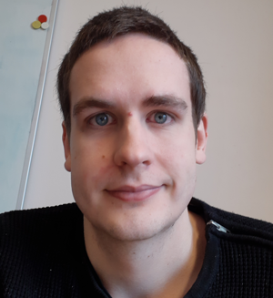
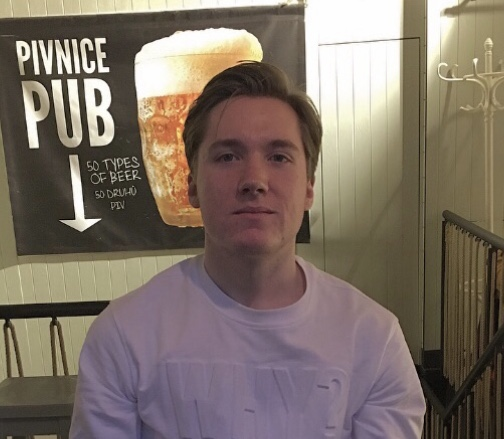

# Medlemmar ([Iyokan])

Projektarbete på kursen Datorsystem med projekt (1DT003) våren 2019, Uppsala universitet.

**TODO:** Tag foton av alla medlemmar i gruppen. Varje foto skall tydligt visa
 personen framifrån från axlarna och uppåt. Spara bilderna i mappen
 `meta/images/`. Fyll sedan i tabellen nedan. Tabellen skall vara sorterad på
 förnamn. Fältet **Förnamn** skall länka till avsnittet med mer detaljer för
 respektive medlem. I tabellen skall alla bilder ha samma bredd.

**INFO:** För sådant som inte går att uttrycka med den variant av Markdown som
GitHub använder går det bra att använda HTML istället. Till exempel går det att
använda en `` tag för att sätta bredden på en bild
till `180` pixlar.

**INFO:** Om ni inte vill bråka med syntaxen för tabeller i Markdown går det bra
 att byta ut hela tabellen mot en HTML-tabell.

**INFO:** För att länka till en rubrik på formen `En rubrik med åäö` använd
ankaret `#en-rubrik-med-åäö`.

Bild | Förnamn | Efternamn | Personnummer | Användarnamn (GitHub)
-----------------------------------------|-----------------------------|-----------|--------------|----------------------
 | [Anton](#anton-bergåker) | Bergåker | YYMMDD-XXXX | [AntonBergaker](https://github.com/AntonBergaker/)
 | [Oscar](#oscar-englöf) | Englöf | 960428-4795 | [ralfkatt](https://github.com/ralfkatt/)
 | [Benjamin](#benjamin-angeria) | Angeria | 960802-8693 | [angeria](https://github.com/angeria/)

**TODO:** Utgå från mallen nedan och skapa ett avsnitt för varje medlem i
gruppen sorterade i bokstavsordning.

## Anton Bergåker

### Okänd talang

När jag inte pluggar gillar jag att jobba på lite olika projekt, ofta olika typer av spel och appar. Spelar även för mycket dataspel, t.ex Stellaris och Factorio.

### Starka sidor

- Server-client kommunikation
- Apputveckling
- Databasdesign
- Problemlösning

### Personlig utveckling

- Jobba i större grupp
- Planering
- iOS
- Mer kunskap i olika programmeringsspråk
- Backend-design och olika metoder

-------------------------------------------------------------------------------------------------------------------------

## Oscar Englöf

### Okänd talang

Jag gillar att träna vid sidan om.

### Starka sidor

Under projektet tror jag att jag kommer ha lättast att bidra med:

- analys/design/specifikation
- problemlösning och algoritmer
- ledarskap
- research (söka och sammanställa information)

### Personlig utveckling

Under projektet hoppas jag förutom att bli ännu bättre på mina redan starka
sidor även ges möjlighet att utveckla följande färdigheter, till exempel:

- planering
- samarbete i projekt

-------------------------------------------------------------------------------------------------------------------------

## Benjamin Angeria

### Okänd talang

Vid sidan av studierna tycker jag om att träna och spela piano. Läser någon bok då och då.

### Starka sidor

Under projektet tror jag att jag kommer ha lättast att bidra med:

- design
- problemlösning
- programmering
- samarbete
- ledarskap
- optimism
- organisering

### Personlig utveckling

Under projektet hoppas jag förutom att bli ännu bättre på mina redan starka
sidor även ges möjlighet att utveckla följande färdigheter, till exempel:

- specificering av problem
- problemlösning och algoritmer
- appdesign
- databasarkitektur
