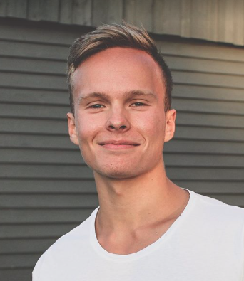
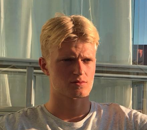
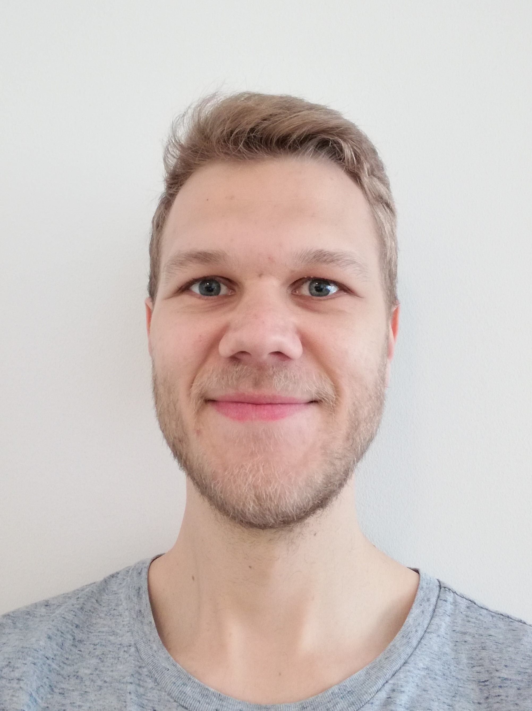

# Medlemmar ([Iyokan])

Projektarbete på kursen Datorsystem med projekt (1DT003) våren 2019, Uppsala universitet.

**TODO:** sortera i bokstavsordning.

Bild | Förnamn | Efternamn | Personnummer | Användarnamn (GitHub)
-----------------------------------------|-----------------------------|-----------|--------------|----------------------
 | [Anton](#anton-bergåker) | Bergåker | 970225-5952 | [AntonBergaker](https://github.com/AntonBergaker/)
 | [Benjamin](#benjamin-angeria) | Angeria | 960802-8693 | [angeria](https://github.com/angeria/)
 | [Erik](#erik-hellström) | Hellström | 950919-2978 | [Erkanerk](https://github.com/erkanerk/)
 | [Gustav](#gustav-börestam) | Börestam | 930804-8793 | [gustavborestam](https://github.com/gustavborestam/)
 | [Oscar](#oscar-englöf) | Englöf | 960428-4795 | [ralfkatt](https://github.com/ralfkatt/)

## Anton Bergåker

### Okänd talang

När jag inte pluggar gillar jag att jobba på lite olika projekt, ofta olika typer av spel och appar. Spelar även för mycket dataspel, t.ex Stellaris och Factorio.

### Starka sidor

- Server-client kommunikation
- Apputveckling
- Databasdesign
- Problemlösning

### Personlig utveckling

- Jobba i större grupp
- Planering
- iOS
- Mer kunskap i olika programmeringsspråk
- Backend-design och olika metoder

-------------------------------------------------------------------------------------------------------------------------

## Benjamin Angeria

### Okänd talang

Vid sidan av studierna tycker jag om att träna och spela piano. Läser någon bok då och då.

### Starka sidor

Under projektet tror jag att jag kommer ha lättast att bidra med:

- design
- problemlösning
- programmering
- samarbete
- ledarskap
- optimism
- organisering

### Personlig utveckling

Under projektet hoppas jag förutom att bli ännu bättre på mina redan starka
sidor även ges möjlighet att utveckla följande färdigheter, till exempel:

- specificering av problem
- problemlösning och algoritmer
- appdesign
- databasarkitektur

-------------------------------------------------------------------------------------------------------------------------

## Erik Hellström

### Okänd talang

Frisbeegolf och rita.

### Starka sidor

Under projektet tror jag att jag kommer ha lättast att bidra med:

- analys/design/specifikation
- algoritmer
- skriva kod utifrån färdig specifikation
- planering
- samarbete
- hitta problem och lösa dem

### Personlig utveckling

Under projektet hoppas jag förutom att bli ännu bättre på mina redan starka
sidor även ges möjlighet att utveckla följande färdigheter, till exempel:

- dokumentation
- rapportskrivande
- muntlig presentation
- Apputveckling
- Distribuerade system

-------------------------------------------------------------------------------------------------------------------------

## Gustav Börestam

### Okänd talang
Utanför studierna är jag intresserad av entreprenörskap, löpträning och resor.

### Starka sidor
Under projektet tror jag att jag kommer ha lättast att bidra med:

- Analys
- Design
- Problemlösning
- Samarbete
- Muntlig presentation
- Användarkrav

### Personlig utveckling
Under projektet hoppas jag förutom att bli ännu bättre på mina redan starka sidor även ges möjlighet att utveckla följande färdigheter:

- Dokumentation
- Skapa skalbar kod som är enkel att arbeta med
- Databaser och gemensamma resurser
- Research
- Realtidsuppdateringar

-------------------------------------------------------------------------------------------------------------------------

## Oscar Englöf

### Okänd talang

Jag gillar att träna vid sidan om.

### Starka sidor

Under projektet tror jag att jag kommer ha lättast att bidra med:

- analys/design/specifikation
- problemlösning och algoritmer
- ledarskap
- research (söka och sammanställa information)

### Personlig utveckling

Under projektet hoppas jag förutom att bli ännu bättre på mina redan starka
sidor även ges möjlighet att utveckla följande färdigheter, till exempel:

- planering
- samarbete i projekt
